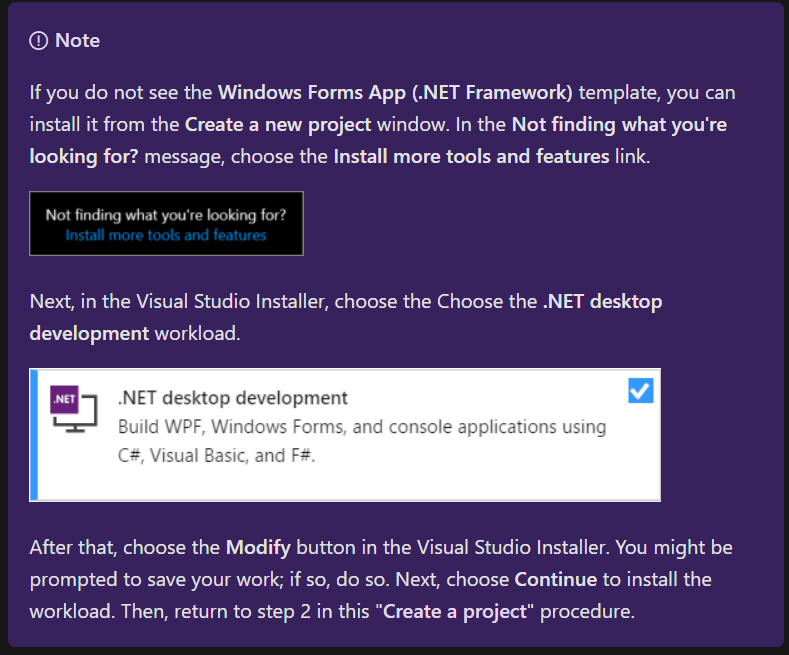
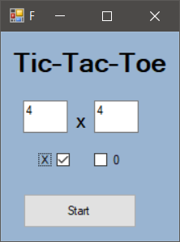
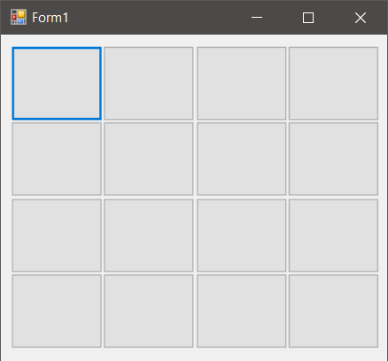
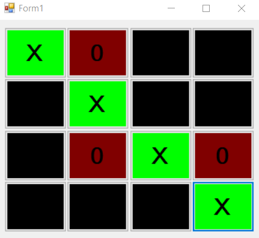
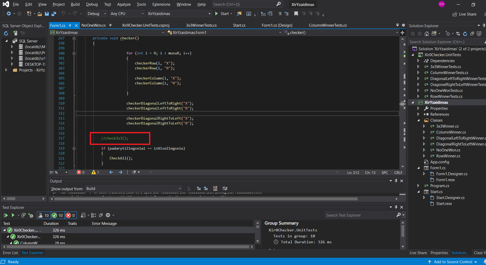
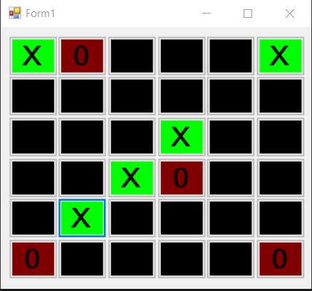
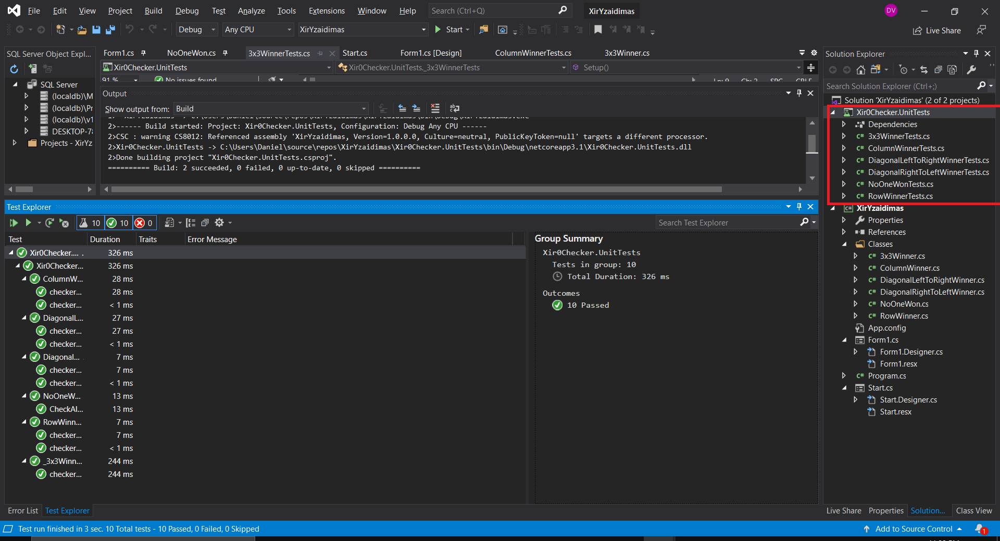

**Dynamic Tic-Tac-Toe Game**
======

## Windows Forms App With C# / Unit Testing C# With NUnit 

### Is Visual Studio good?

*,,Visual Studio" is probably the most serious IDE of the planet & the best software ever made by Microsoft. It does every single thing very nicely what is was made for. It has the best ever Intellisense support than any other IDE what makes your coding experience much more smooth & faster.*

### What is Windows Forms App

*Windows Forms is a UI framework for building Windows desktop apps. It provides one of the most productive ways to create desktop apps based on the visual designer provided in Visual Studio. Functionality such as drag-and-drop placement of visual controls makes it easy to build desktop apps.*

### What is Unit Testing With NUnit 

*NUnit is a unit testing framework for performing unit testing based on the . NET platform. It is a widely used tool for unit testing and is preferred by many developers today. NUnit is free to use.*

### More About Press Click

[Windows Forms App](https://docs.microsoft.com/en-us/visualstudio/ide/step-1-create-a-windows-forms-application-project?view=vs-2019)
[What is Unit Testing With NUnit ](https://docs.microsoft.com/en-us/dotnet/core/testing/unit-testing-with-nunit)

## Tic-Tac-Toe Dynamic
===

### What is Dynamic Tic-Tac-Toe game stands for?

*In Tic Tac Toe, 2 players take turns adding their token (an X or an O) to a N X N, for the more ambitious) grid until one player matches (N) in a row in any direction.*

### More About

[AI in a dynamic Tic-Tac-Toe Game](https://www.gamedev.net/forums/topic/482376-ai-in-a-dynamic-tic-tac-toe-game/)
===

## First Of All
===

## How To Install Project? 
===

### 1) Download Code ---> Download Zip
### 2) Extract ZIP file
### 3) Open XirYzaidimas.sln
### 4) (While It Opens) Agree With All Terms...(If needed)
### 5) Press Run button (at the top) to start the game..
### 6) Enjoy =)

## How To Play?
===

### Before we start, enter N x N,for create a grid (Height,Weight)
### And choose who will start the game ( X or 0 )

### Here You are (4x4 grid) !

===

### Game Ends by 5 Rules:
- Draw
- Row
- Column
- Diagonal From Left To Right
- Diagonal from Right To Left

### One Of The Game End Actions ex.

### In the project, you can activate such a function as 3x3 win, regardless of grid size 3x3 coincidence wins... 

## What About Tests:
===

## PARTICIPATED/CONTACT
===

1. Daniel - [Developer](https://www.greatsampleresume.com/job-responsibilities/it-developer-responsibilities/) - *daniel.vaskevic123@gmail.com*

